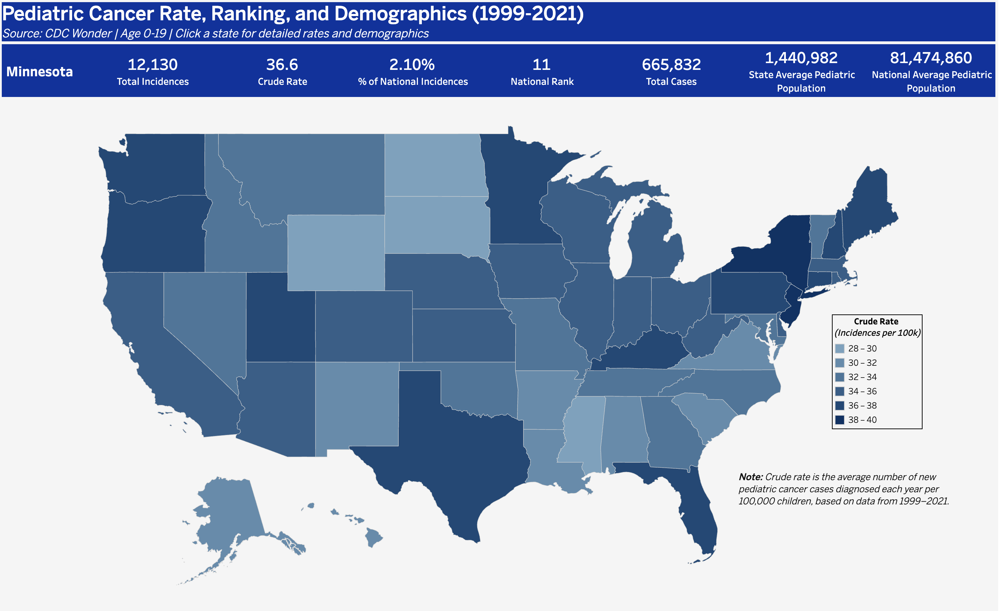

# 📊 Pediatric Cancer Incidence in the U.S. (1999–2021)  

## 📝 Overview  
This project analyzes **pediatric cancer incidence trends** in the United States between 1999–2021 using CDC WONDER data. The goal is to uncover geographic and demographic disparities, highlight changes over time, and provide insights for clinicians, policymakers, and researchers interested in childhood cancer burden.  

---

## 📂 Dataset(s)  
- **Source:** [CDC WONDER Cancer Statistics – Pediatric Cancer Incidence](https://wonder.cdc.gov/cancer.html)  
- **Timeframe:** 1999–2021  
- **Variables:**  
  - Cancer site (parent & subtype)  
  - State  
  - Year  
  - Age group (0–19, broken into 5 subgroups)  
  - Sex  
  - Race/ethnicity  
  - Population, case counts, crude rates (per 100k)  
- **Notes:**  
  - Suppressed counts (<16) are masked in the data.  
  - Crude rates were recalculated to ensure consistency when aggregating populations.  

---

## 🛠️ Tools & Skills  
- **Languages:** R, Python  
- **Libraries:** tidyverse, janitor, pandas, numpy, matplotlib  
- **Visualization:** Tableau Public ([Dashboard link below](#-dashboard))  
- **Techniques:**  
  - Data cleaning & preprocessing  
  - Exploratory data analysis  
  - Demographic stratification (age, sex, race)  
  - Dashboard design & storytelling  

---

## 🔄 Data Preparation  
1. Downloaded raw incidence files from CDC WONDER (`.txt` format).  
2. Cleaned data using R scripts:  
   - Dropped metadata columns (`*_code`, Notes).  
   - Standardized variable names.  
   - Converted crude rates (per million → per 100k).  
   - Grouped cancer subtypes into parent categories (e.g., “Leukemia” from “Lymphoid,” “Myeloid,” etc.).  
3. Created multiple cleaned CSVs at different granularities:  
   - `site_state`  
   - `site_state_sex`  
   - `site_state_age`  
   - `site_state_race`  
   - `state_year`  
4. Saved processed datasets to `/data/incidence/clean/`.

👉 See the script here: [`scripts/clean_incidence_data.R`](scripts/clean_incidence_data.R)


### Repository Structure
```text
```text
data/
└── incidence/
    └── clean/      # Processed .csv files ready for analysis
scripts/
└── clean_incidence_data.R  # R script to clean raw files
.gitignore                   # Excludes raw data and temp files
Pediatric Cancer Capstone.Rproj  # R project file
README.md                    # Project documentation
```

## 📈 Analysis  
- ✅ Calculated incidence rates per 100k for all sites and by cancer subtype.  
- ✅ Compared trends across states, demographics, and years.  
- ✅ Identified disparities (e.g., differences by race, age group, or geography).  
- ✅ Built drill-down functionality in Tableau to move from national → state → demographic detail.  

---

## 📊 Dashboard  
- **View the Tableau Dashboard Here:**  
[](https://public.tableau.com/app/profile/josh.fugate/viz/PediatricCancerIncidenceRates/MapDashboard)
- **Key Features:**  
  - 🌎 Interactive U.S. map with state drill-down  
  - 📈 Trend lines showing year-over-year incidence  
  - 🧒 Demographic comparisons (age, sex, race)  
  - 🧭 Dynamic filters (Year, State, Cancer Site)  
  - 📊 KPIs and BANs for quick reference  

---

## 💡 Key Insights  
- **Geographic variation**: Certain states consistently report higher pediatric cancer incidence than others.  
- **Demographic disparities**: Leukemia remains the most common cancer in children, with varying rates across age groups and races.  
- **Temporal trends**: National incidence rates have shown modest increases over the past two decades, with site-specific differences.  

---

## 📌 Limitations & Next Steps  
- **Limitations:**  
  - Suppressed counts (<10 cases) reduce visibility for rare cancers.  
  - No socioeconomic or environmental covariates included.  
  - Mortality data not yet integrated.  

- **Next Steps:**  
  - Add mortality and survival outcomes for comparison.  
  - Incorporate socioeconomic factors (income, insurance, urban/rural).  
  - Apply statistical modeling for predictive insights.  
  - Automate CDC WONDER queries (using RSelenium) for faster dataset refreshes.  

---

## 👤 Author  
**Joshua Fugate**  
- LinkedIn: [linkedin.com/in/josh-fugate](https://linkedin.com/in/josh-fugate)  
- GitHub: [github.com/josh-fugate](https://github.com/josh-fugate)  
- Tableau: [public.tableau.com/profile/josh.fugate](https://public.tableau.com/profile/josh.fugate)  
